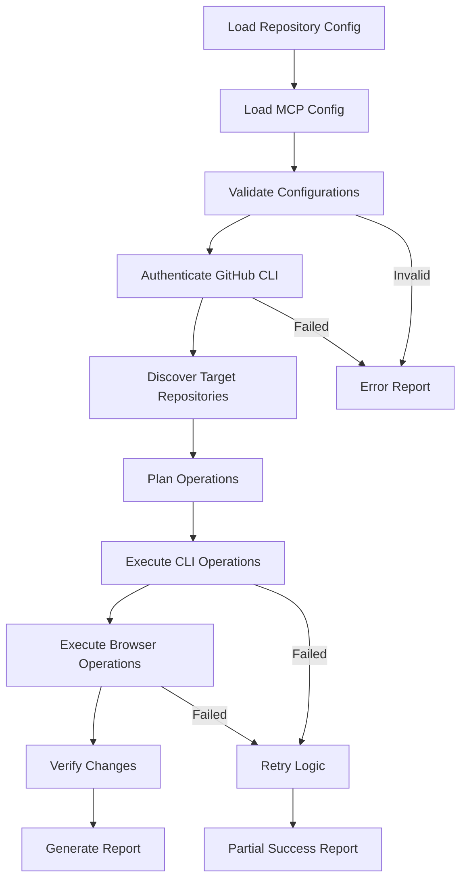

# Technical Specification: Bulk GitHub Copilot Agent Configurator

## Executive Summary

This document outlines the technical architecture and implementation details for a tool that automates the bulk configuration of GitHub Copilot agent MCP (Model Context Protocol) settings across personal repositories. The tool employs a hybrid approach combining GitHub CLI for repository secrets/variables and browser automation for MCP configuration.

## 1. Architecture Overview

### 1.1 System Components

```
┌─────────────────────────────────────────────────────────────┐
│                  Configuration Engine                       │
├─────────────────┬─────────────────┬─────────────────────────┤
│   Config Parser │   Orchestrator  │    Logging & Reports    │
├─────────────────┼─────────────────┼─────────────────────────┤
│                 │                 │                         │
│  ┌─────────────┐│  ┌─────────────┐│  ┌─────────────────────┐│
│  │GitHub CLI   ││  │Browser      ││  │Credential           ││
│  │Integration  ││  │Automation   ││  │Management           ││
│  └─────────────┘│  └─────────────┘│  └─────────────────────┘│
└─────────────────┴─────────────────┴─────────────────────────┘
```

### 1.2 Core Modules

#### Configuration Engine
- **Purpose**: Central orchestration of configuration tasks
- **Responsibilities**: 
  - Parse and validate separate configuration files (repos, MCP config, secrets)
  - Coordinate between CLI and browser automation
  - Manage execution flow and error handling
  - Handle MCP configuration merge strategies

#### GitHub CLI Integration
- **Purpose**: Handle API-accessible operations
- **Capabilities**:
  - Repository secrets management
  - Repository variables
  - Repository discovery and filtering
  - User authentication

#### Browser Automation Module
- **Purpose**: Handle MCP configuration operations
- **Capabilities**:
  - Navigate to GitHub Copilot agent settings
  - Read existing MCP configurations
  - Apply new/merged MCP configurations
  - Handle authentication and session management

#### Repository Selection Engine
- **Purpose**: Flexible repository targeting
- **Capabilities**:
  - Individual repository specification
  - "All accessible repos" discovery
  - Pattern-based matching
  - Topic and metadata filtering

## 2. Configuration System

### 2.1 Separate Configuration Files

The tool uses a multi-file configuration approach for clarity and flexibility:

#### Repository Selection (`repos.yaml`)
```yaml
# Option 1: Explicit repository list
repositories:
  - "username/repo1"
  - "username/repo2"

# Option 2: All accessible repositories
all_accessible_repos: true
filters:
  owner_only: true
  topics: ["copilot-enabled"]
  exclude: ["username/old-repo"]

# Option 3: Pattern-based selection
repositories:
  patterns:
    - "username/*-service"
    - "username/app-*"
```

#### MCP Configuration (`mcp-config.yaml`)
```yaml
# This content gets inserted into the GitHub Copilot Agent MCP field
github:
  enabled: true
  config:
    token_source: "env:GITHUB_TOKEN"

playwright:
  enabled: true
  config:
    headless: true
```

#### Optional Secrets (`secrets.yaml`)
```yaml
secrets:
  CUSTOM_API_TOKEN: "{{ env.CUSTOM_API_TOKEN }}"
  
variables:
  LOG_LEVEL: "info"
```

### 2.2 MCP Configuration Handling Strategies

| Strategy | Behavior | Use Case |
|----------|----------|----------|
| `--skip-existing` | Skip repos with existing MCP config | Conservative, no overwrites |
| `--merge` | Add new servers, keep existing | Additive configuration |
| `--merge --overwrite-existing` | Merge, update servers with same names | Smart merge with updates |
| `--force-overwrite` | Replace entire MCP configuration | Complete replacement |

### 2.3 API Operations vs Browser Automation

#### GitHub CLI Operations
| Configuration Type | CLI Command | Permissions Required |
|-------------------|-------------|---------------------|
| Repository Secrets | `gh secret set` | Repository Admin |
| Repository Variables | `gh variable set` | Repository Admin |
| Repository Discovery | `gh repo list` | Read access |
| Repository Metadata | `gh repo view` | Read access |

#### Browser Automation Required
| Configuration Type | Location | Navigation Path |
|-------------------|----------|-----------------|
| MCP Server Config | Repository Settings | Settings → Copilot → Coding agent |
| Read Existing MCP | Repository Settings | Same as above |
| Update MCP Config | Repository Settings | Same as above |

## 3. Security and Authentication

### 3.1 Authentication Architecture

```yaml
authentication:
  github_cli:
    method: "personal_access_token"
    scope: ["repo", "read:user"]
    token_source: "gh auth status"
    refresh_strategy: "manual"
  
  browser_automation:
    method: "session_inheritance"
    source: "github_cli_session"
    isolation: "per_repository"
    cleanup: "automatic"
```

### 3.2 Credential Management

#### Environment Variables
- **Source**: Environment variables for sensitive data
- **Pattern**: `{{ env.VARIABLE_NAME }}` in configuration files
- **Security**: Never stored in plain text, injected at runtime

#### GitHub Authentication
- **Method**: GitHub CLI personal access token
- **Permissions**: Repository admin access for target repositories
- **Session**: Shared between CLI and browser automation

### 3.3 Security Considerations

#### Personal Account Focus
- **Scope**: Individual GitHub accounts only
- **Permissions**: Repository-level admin access required
- **No Organization Features**: No org-level secrets, policies, or firewall rules

#### Browser Security
- **Headless Mode**: No GUI, runs in background
- **Session Isolation**: Each repository uses separate browser context
- **Credential Injection**: Tokens injected programmatically, not stored
- **Automatic Cleanup**: Browser sessions cleaned up after each repository

### 3.4 Simple Logging

#### Log Structure
```json
{
  "timestamp": "2024-01-15T10:30:00Z",
  "repository": "username/repo-name",
  "action": "mcp_config_update",
  "changes": {
    "before": { "servers": [] },
    "after": { "servers": [{"name": "github", "enabled": true}] }
  },
  "status": "success",
  "duration_ms": 1250,
  "merge_strategy": "merge"
}
```

#### Logging Features
- **Operation Tracking**: All configuration changes logged
- **Before/After States**: Clear change documentation
- **Error Details**: Comprehensive error information for troubleshooting
- **Performance Metrics**: Timing and success rates

## 4. Implementation Design

### 4.1 Configuration Processing Pipeline



### 4.2 MCP Configuration Workflow

#### Reading Existing Configuration
1. Navigate to repository Copilot settings
2. Extract existing MCP configuration JSON
3. Parse and validate structure
4. Store current state for comparison

#### Applying New Configuration
1. Determine merge strategy from options
2. Apply merge logic (skip, merge, overwrite)
3. Validate final configuration
4. Submit changes via browser automation
5. Verify application success

#### Merge Strategies Implementation
```typescript
interface MCPMerger {
  skip(existing: MCPConfig, new: MCPConfig): MCPConfig;
  merge(existing: MCPConfig, new: MCPConfig): MCPConfig;
  mergeWithOverwrite(existing: MCPConfig, new: MCPConfig): MCPConfig;
  forceOverwrite(existing: MCPConfig, new: MCPConfig): MCPConfig;
}
```
    G -->|Failed| K
    K --> L[Partial Success Report]
```

### 4.2 Error Handling Strategy

#### Error Classification
```typescript
enum ErrorSeverity {
  RECOVERABLE = "recoverable",    // Retry possible
  CONFIGURATION = "config",       // User action required
  PERMISSION = "permission",      // Access issue
  FATAL = "fatal"                // Stop execution
}

interface ErrorHandler {
  classify(error: Error): ErrorSeverity;
  retry(operation: Operation): Promise<Result>;
  escalate(error: Error): void;
  recover(state: ExecutionState): Promise<void>;
}
```

### 4.3 Error Handling Strategy

#### Error Classification
```typescript
enum ErrorSeverity {
  RECOVERABLE = "recoverable",    // Retry possible
  CONFIGURATION = "config",       // User action required  
  PERMISSION = "permission",      // Access issue
  FATAL = "fatal"                // Stop execution
}
```

#### Recovery Mechanisms
- **Automatic Retry**: For transient browser/network issues
- **Skip and Continue**: For permission errors on specific repositories
- **Resume Operations**: Save progress and resume from last successful repository
- **Detailed Logging**: Comprehensive error information for troubleshooting

### 4.4 Repository Discovery

#### Discovery Methods
1. **Explicit List**: Direct repository specification
2. **All Accessible**: Query user's accessible repositories via GitHub API
3. **Pattern Matching**: Filter repositories by name patterns
4. **Topic Filtering**: Filter by repository topics and metadata

#### Implementation
```typescript
interface RepositoryDiscovery {
  explicitList(repos: string[]): Repository[];
  allAccessible(filters: RepoFilters): Repository[];
  byPattern(patterns: string[]): Repository[];
  byTopics(topics: string[]): Repository[];
}
```

### 4.5 Concurrency Control

#### Repository Processing
```yaml
concurrency:
  max_parallel_repos: 3        # Conservative for personal use
  browser_sessions: 1          # Single browser instance
  timeout_settings:
    cli_operation: 30s
    browser_operation: 60s
    total_workflow: 20m
```

#### Resource Management
- **Simple Connection Reuse**: Reuse GitHub CLI authentication
- **Single Browser Instance**: Minimize resource usage
- **Progressive Processing**: Handle repositories one-by-one for MCP config
- **Graceful Failure Handling**: Continue with remaining repositories on errors

## 5. Implementation Phases

## 5. Implementation Phases

### 5.1 Phase 1: Core Infrastructure (Weeks 1-2)

#### Deliverables
- [ ] Multi-file configuration parser (repos.yaml, mcp-config.yaml, secrets.yaml)
- [ ] GitHub CLI integration wrapper
- [ ] Repository discovery engine
- [ ] Basic logging framework
- [ ] Unit test suite (>80% coverage)

#### Technical Tasks
```typescript
// Configuration schema definitions
interface RepoConfig {
  repositories?: string[];
  all_accessible_repos?: boolean;
  filters?: RepoFilters;
  options?: ProcessingOptions;
}

interface MCPConfig {
  [serverName: string]: {
    enabled: boolean;
    config: Record<string, any>;
  };
}

// CLI wrapper implementation
class GitHubCLI {
  async listUserRepos(filters: RepoFilters): Promise<Repository[]>;
  async setSecret(repo: string, name: string, value: string): Promise<void>;
  async setVariable(repo: string, name: string, value: string): Promise<void>;
}
```

### 5.2 Phase 2: Browser Automation (Weeks 3-4)

#### Deliverables
- [ ] Playwright-based automation framework
- [ ] MCP server configuration automation
- [ ] MCP merge strategy implementation
- [ ] Integration tests with test repositories

#### Technical Implementation
```typescript
class BrowserAutomator {
  private browser: Browser;
  
  async readMCPConfig(repo: string): Promise<MCPConfig>;
  async updateMCPConfig(repo: string, config: MCPConfig): Promise<void>;
  async mergeMCPConfig(existing: MCPConfig, new: MCPConfig, strategy: MergeStrategy): Promise<MCPConfig>;
}
```

### 5.3 Phase 3: Advanced Features (Weeks 5-6)

#### Deliverables
- [ ] Pattern-based repository selection
- [ ] Resume and retry functionality
- [ ] Comprehensive error handling
- [ ] Progress reporting and summaries

#### Advanced Features
- **Smart Filtering**: Topic-based and metadata filtering
- **Progress Tracking**: Real-time status updates
- **Error Recovery**: Resume from interruptions
- **Batch Processing**: Efficient handling of large repository sets

### 5.4 Phase 4: Polish and Documentation (Week 7-8)

#### Deliverables
- [ ] Complete documentation and examples
- [ ] CLI interface improvements
- [ ] Performance optimization
- [ ] User experience enhancements

## 6. CLI Interface Design

### 6.1 Command Structure

```bash
# Basic usage
npm run configure -- --repos repos.yaml --mcp-config mcp-config.yaml [options]

# Configuration files
--repos <file>           # Repository selection configuration
--mcp-config <file>      # MCP server configuration
--secrets <file>         # Optional secrets and variables

# MCP handling options
--skip-existing         # Skip repos with existing MCP config
--merge                 # Merge new MCP servers with existing
--merge --overwrite-existing  # Merge and overwrite matching servers
--force-overwrite       # Replace entire MCP configuration

# Processing options
--dry-run              # Preview changes without applying
--concurrency <n>      # Number of parallel repositories (default: 3)
--resume               # Resume from last failed repository
--retry-failed         # Retry only failed repositories

# Output options
--verbose              # Detailed logging
--quiet                # Minimal output
--json                 # JSON output format
--error-report         # Generate detailed error report
```

### 6.2 Configuration Validation

```typescript
interface ConfigValidator {
  validateRepoConfig(config: RepoConfig): ValidationResult;
  validateMCPConfig(config: MCPConfig): ValidationResult;
  validateSecrets(config: SecretsConfig): ValidationResult;
  
  // Cross-validation
  validateCompatibility(repoConfig: RepoConfig, mcpConfig: MCPConfig): ValidationResult;
}

interface ValidationResult {
  valid: boolean;
  errors: ValidationError[];
  warnings: ValidationWarning[];
}
```

### 6.3 Progress Reporting

```typescript
interface ProgressReporter {
  startOperation(totalRepos: number): void;
  updateProgress(completed: number, current: string, status: string): void;
  reportError(repo: string, error: Error): void;
  generateSummary(): OperationSummary;
}

interface OperationSummary {
  totalRepositories: number;
  successful: number;
  failed: number;
  skipped: number;
  errors: RepositoryError[];
  duration: number;
}
```

## 7. Development and Testing

### 7.1 Local Development Setup

```bash
# Prerequisites
node --version  # 18+
gh --version    # GitHub CLI authenticated
chromium --version  # or Chrome browser

# Clone and setup
git clone https://github.com/your-username/bulk-github-copilot-agent-config
cd bulk-github-copilot-agent-config
npm install

# Development commands
npm run dev       # Development mode with hot reload
npm run test      # Run test suite
npm run lint      # Code linting
npm run build     # Production build
```

### 7.2 Testing Strategy

#### Unit Tests
- Configuration parsing and validation
- Repository discovery logic
- MCP merge strategy algorithms
- Error handling and recovery

#### Integration Tests
- GitHub CLI command execution
- Browser automation workflows
- Authentication and session management

#### End-to-End Tests
- Complete configuration workflows
- Multiple repository processing
- Error recovery scenarios

### 7.3 Test Configuration

```yaml
# test-config/repos.yaml - for testing
repositories:
  - "testuser/test-repo-1"
  - "testuser/test-repo-2"

options:
  concurrency: 1
  verbose: true
```

## 8. Security Considerations

### 8.1 Personal Account Security

#### Authentication
- GitHub CLI personal access token required
- Token needs `repo` scope for repository access
- Browser automation inherits CLI authentication session

#### Data Protection
- No persistent credential storage
- Environment variables for sensitive configuration
- Automatic cleanup of browser sessions
- Local operation logs only

#### Safe Defaults
- Dry-run mode by default for destructive operations
- Conservative concurrency limits
- Comprehensive logging for audit purposes
- Skip existing configurations by default

### 8.2 Risk Mitigation

| Risk | Mitigation |
|------|------------|
| Accidental overwrites | Dry-run mode, skip-existing default |
| Authentication exposure | Environment variables, no disk storage |
| Rate limiting | Conservative concurrency, exponential backoff |
| Browser instability | Headless mode, session isolation |

## 9. Future Enhancements

### 9.1 Planned Features

#### Phase 1 Extensions
- **Repository Templates**: Save and reuse MCP configurations
- **Diff Reporting**: Show exact changes before applying
- **Backup/Restore**: Save current configurations before changes
- **Configuration Profiles**: Named configuration sets for different use cases

#### Phase 2 Extensions
- **GitHub App Support**: Alternative authentication method
- **Configuration Validation**: Pre-flight checks for MCP server compatibility
- **Rollback Capability**: Undo configuration changes
- **Integration Testing**: Test MCP configurations before deployment

### 9.2 API Enhancement Opportunities

As GitHub expands their API capabilities, the tool can be enhanced to:
- Use native API for MCP configuration (when available)
- Reduce browser automation dependency
- Improve reliability and performance
- Add real-time configuration monitoring

## 10. Conclusion

This specification outlines a focused, personal-use tool for bulk GitHub Copilot agent configuration. The design prioritizes:

- **Simplicity**: Easy setup and configuration for individual developers
- **Safety**: Conservative defaults and comprehensive validation
- **Flexibility**: Multiple configuration strategies and merge options
- **Reliability**: Robust error handling and recovery mechanisms

### Implementation Timeline

- **Week 1-2**: Core configuration parsing and repository discovery
- **Week 3-4**: Browser automation and MCP configuration
- **Week 5-6**: Error handling, resume/retry functionality
- **Week 7-8**: Documentation, testing, and polish

The tool addresses a real need for personal GitHub users who want to efficiently manage MCP configurations across multiple repositories without manual, repetitive configuration work.

---

**Document Version**: 1.0  
**Last Updated**: 2024-01-15  
**Focus**: Personal GitHub account automation  
**Next Review**: After Phase 1 implementation
