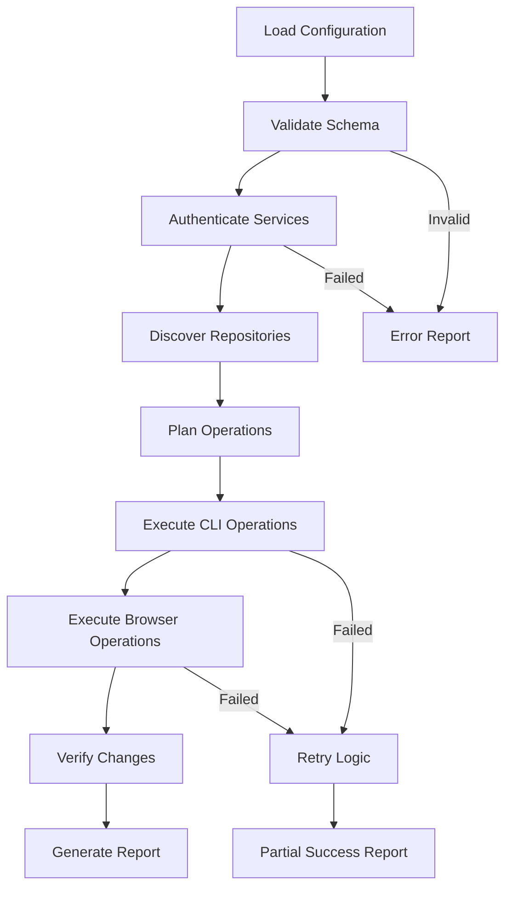

# Technical Specification: Bulk GitHub Copilot Agent Configurator

## Executive Summary

This document outlines the technical architecture and implementation details for a tool that automates the bulk configuration of GitHub Copilot agent settings across multiple repositories. The tool employs a hybrid approach combining GitHub CLI for API-accessible operations and browser automation for web-only settings.

## 1. Architecture Overview

### 1.1 System Components

```
┌─────────────────────────────────────────────────────────────┐
│                  Configuration Engine                       │
├─────────────────┬─────────────────┬─────────────────────────┤
│   Config Parser │   Orchestrator  │    Audit & Logging     │
├─────────────────┼─────────────────┼─────────────────────────┤
│                 │                 │                         │
│  ┌─────────────┐│  ┌─────────────┐│  ┌─────────────────────┐│
│  │GitHub CLI   ││  │Browser      ││  │Credential           ││
│  │Integration  ││  │Automation   ││  │Management           ││
│  └─────────────┘│  └─────────────┘│  └─────────────────────┘│
└─────────────────┴─────────────────┴─────────────────────────┘
```

### 1.2 Core Modules

#### Configuration Engine
- **Purpose**: Central orchestration of configuration tasks
- **Responsibilities**: 
  - Parse and validate configuration files
  - Coordinate between CLI and browser automation
  - Manage execution flow and error handling

#### GitHub CLI Integration
- **Purpose**: Handle API-accessible operations
- **Capabilities**:
  - Repository secrets management
  - Organization variables
  - Basic repository settings
  - User authentication

#### Browser Automation Module
- **Purpose**: Handle web-only configuration operations
- **Capabilities**:
  - MCP server configuration
  - Advanced security settings
  - Organization-level firewall rules
  - Settings not exposed via API

#### Credential Management
- **Purpose**: Secure handling of sensitive data
- **Features**:
  - Environment variable injection
  - External secret manager integration
  - Token rotation and validation
  - Audit trail maintenance

## 2. Configuration Mapping

### 2.1 API-Accessible via GitHub CLI

| Configuration Type | CLI Command | Scope | Permissions Required |
|-------------------|-------------|-------|---------------------|
| Repository Secrets | `gh secret set` | Repository | Admin |
| Organization Secrets | `gh secret set --org` | Organization | Owner |
| Repository Variables | `gh variable set` | Repository | Admin |
| Repository Settings | `gh repo edit` | Repository | Admin |
| Branch Protection | `gh api` calls | Repository | Admin |

### 2.2 Browser Automation Required

| Configuration Type | Location | Navigation Path | Permissions Required |
|-------------------|----------|-----------------|---------------------|
| MCP Server Config | Repository Settings | Settings → Copilot → Coding agent | Admin |
| IP Allow Lists | Organization Settings | Settings → Authentication security | Owner |
| Enterprise Security | Enterprise Settings | Settings → Security → Authentication | Enterprise Owner |
| Advanced Branch Rules | Repository Settings | Settings → Branches → Protection rules | Admin |
| Security Analysis | Repository Settings | Settings → Security & analysis | Admin |

### 2.3 Hybrid Operations

Some configurations require both approaches:
- **Security Policies**: CLI for basic settings, browser for advanced options
- **Access Controls**: CLI for team permissions, browser for fine-grained rules
- **Integration Settings**: CLI for webhooks, browser for advanced integrations

## 3. Security Framework

### 3.1 Authentication Architecture

```yaml
authentication:
  github_cli:
    method: "oauth_token"
    scope: ["repo", "admin:org", "admin:enterprise"]
    token_source: "environment"
    refresh_strategy: "automatic"
  
  browser_automation:
    method: "session_injection"
    session_duration: "30_minutes"
    isolation: "per_repository"
    cleanup: "automatic"
```

### 3.2 Credential Security

#### Storage Principles
- **No Persistent Storage**: Credentials never written to disk
- **Memory Protection**: Sensitive data cleared after use
- **Environment Variables**: Primary source for secrets
- **External Integrations**: Support for HashiCorp Vault, AWS Secrets Manager

#### Token Management
```typescript
interface TokenManager {
  rotateToken(service: string): Promise<string>;
  validateToken(token: string): Promise<boolean>;
  getTokenExpiry(token: string): Date;
  refreshToken(service: string): Promise<string>;
}
```

### 3.3 Audit and Compliance

#### Audit Log Structure
```json
{
  "timestamp": "2024-01-15T10:30:00Z",
  "operation_id": "config-batch-001",
  "user": {
    "github_username": "admin-user",
    "session_id": "sess_abc123"
  },
  "repository": "org/repo-name",
  "action": "mcp_server_update",
  "changes": {
    "before": { "servers": [] },
    "after": { "servers": [{"name": "github", "enabled": true}] }
  },
  "status": "success",
  "duration_ms": 1250,
  "metadata": {
    "config_version": "1.2.0",
    "automation_method": "browser"
  }
}
```

#### Compliance Features
- **SOX Compliance**: Immutable audit logs with cryptographic signatures
- **GDPR Compliance**: PII scrubbing in logs and screenshots
- **SOC 2**: Access controls and segregation of duties
- **FedRAMP**: Enhanced security controls for government deployments

## 4. Workflow Design

### 4.1 Configuration Processing Pipeline



### 4.2 Error Handling Strategy

#### Error Classification
```typescript
enum ErrorSeverity {
  RECOVERABLE = "recoverable",    // Retry possible
  CONFIGURATION = "config",       // User action required
  PERMISSION = "permission",      // Access issue
  FATAL = "fatal"                // Stop execution
}

interface ErrorHandler {
  classify(error: Error): ErrorSeverity;
  retry(operation: Operation): Promise<Result>;
  escalate(error: Error): void;
  recover(state: ExecutionState): Promise<void>;
}
```

#### Retry Mechanisms
- **Exponential Backoff**: For rate limiting and transient failures
- **Circuit Breaker**: Prevent cascading failures
- **Partial Recovery**: Continue with successful repositories
- **State Persistence**: Resume from failure points

### 4.3 Concurrency Control

#### Repository Processing
```yaml
concurrency:
  max_parallel_repos: 5
  cli_rate_limit: 5000  # requests per hour
  browser_sessions: 3
  timeout_settings:
    cli_operation: 30s
    browser_operation: 60s
    total_workflow: 30m
```

#### Resource Management
- **Connection Pooling**: Reuse GitHub API connections
- **Browser Instance Management**: Minimize Chrome instances
- **Memory Monitoring**: Prevent resource exhaustion
- **Graceful Degradation**: Reduce concurrency on failures

## 5. Implementation Phases

### 5.1 Phase 1: Core Infrastructure (Weeks 1-3)

#### Deliverables
- [ ] Configuration parser and validator
- [ ] GitHub CLI integration wrapper
- [ ] Basic credential management
- [ ] Audit logging framework
- [ ] Unit test suite (>80% coverage)

#### Technical Tasks
```typescript
// Configuration schema definition
interface ConfigSchema {
  repositories: string[];
  mcp_servers: MCPServerConfig[];
  secrets: SecretConfig;
  security: SecurityConfig;
  options: ExecutionOptions;
}

// CLI wrapper implementation
class GitHubCLI {
  async setSecret(repo: string, name: string, value: string): Promise<void>;
  async setVariable(repo: string, name: string, value: string): Promise<void>;
  async updateRepoSettings(repo: string, settings: RepoSettings): Promise<void>;
}
```

### 5.2 Phase 2: Browser Automation (Weeks 4-6)

#### Deliverables
- [ ] Playwright-based automation framework
- [ ] MCP server configuration automation
- [ ] Session management and security
- [ ] Integration tests with test repositories

#### Technical Implementation
```typescript
class BrowserAutomator {
  private browser: Browser;
  private contexts: Map<string, BrowserContext>;
  
  async configureMCPServers(repo: string, config: MCPConfig): Promise<void>;
  async updateFirewallRules(org: string, rules: FirewallRule[]): Promise<void>;
  async captureScreenshot(context: string, purpose: string): Promise<Buffer>;
}
```

### 5.3 Phase 3: Enterprise Features (Weeks 7-9)

#### Deliverables
- [ ] Organization-level bulk operations
- [ ] Advanced security configurations
- [ ] Compliance reporting
- [ ] Performance optimization

#### Advanced Features
- **Policy Templates**: Predefined security configurations
- **Drift Detection**: Monitor configuration changes
- **Rollback Capabilities**: Undo bulk changes
- **Integration APIs**: External system connections

### 5.4 Phase 4: Production Readiness (Weeks 10-12)

#### Deliverables
- [ ] Production deployment scripts
- [ ] Monitoring and alerting
- [ ] Documentation and training materials
- [ ] Security audit and penetration testing

## 6. API Design

### 6.1 Configuration API

```typescript
interface ConfigurationAPI {
  // Repository operations
  configureRepository(repo: string, config: RepoConfig): Promise<Result>;
  bulkConfigureRepositories(repos: string[], config: RepoConfig): Promise<BulkResult>;
  
  // Organization operations
  configureOrganization(org: string, config: OrgConfig): Promise<Result>;
  
  // Validation and planning
  validateConfiguration(config: Configuration): ValidationResult;
  planExecution(config: Configuration): ExecutionPlan;
  
  // Monitoring and reporting
  getExecutionStatus(operationId: string): ExecutionStatus;
  generateComplianceReport(scope: Scope): ComplianceReport;
}
```

### 6.2 Plugin Architecture

```typescript
interface ConfigurationPlugin {
  name: string;
  version: string;
  supportedOperations: string[];
  
  configure(target: string, config: any): Promise<Result>;
  validate(config: any): ValidationResult;
  rollback(target: string, operation: string): Promise<Result>;
}

// Example plugin implementations
class MCPServerPlugin implements ConfigurationPlugin {
  // MCP-specific configuration logic
}

class FirewallPlugin implements ConfigurationPlugin {
  // Firewall configuration logic
}
```

## 7. Monitoring and Observability

### 7.1 Metrics Collection

```yaml
metrics:
  performance:
    - operation_duration
    - success_rate
    - error_rate
    - throughput_repos_per_hour
  
  reliability:
    - retry_attempts
    - failure_modes
    - recovery_time
    - session_stability
  
  security:
    - authentication_failures
    - permission_denials
    - suspicious_activity
    - audit_log_integrity
```

### 7.2 Alerting Framework

```typescript
interface AlertManager {
  configureThresholds(metric: string, threshold: number): void;
  sendAlert(severity: AlertSeverity, message: string): void;
  escalateAlert(alertId: string): void;
  acknowledgeAlert(alertId: string, user: string): void;
}

enum AlertSeverity {
  INFO = "info",
  WARNING = "warning",
  CRITICAL = "critical",
  EMERGENCY = "emergency"
}
```

## 8. Deployment Architecture

### 8.1 Container Strategy

```dockerfile
FROM node:18-alpine
WORKDIR /app

# Install Chrome dependencies
RUN apk add --no-cache chromium

# Install GitHub CLI
RUN apk add --no-cache github-cli

# Application setup
COPY package*.json ./
RUN npm ci --only=production
COPY . .

# Security hardening
RUN addgroup -g 1001 -S nodejs
RUN adduser -S runner -u 1001
USER runner

CMD ["npm", "start"]
```

### 8.2 Infrastructure Requirements

#### Minimum Requirements
- **CPU**: 2 cores
- **Memory**: 4GB RAM
- **Storage**: 20GB SSD
- **Network**: 100 Mbps internet connection
- **OS**: Linux (Ubuntu 20.04+, RHEL 8+, Alpine 3.15+)

#### Recommended Production Setup
- **CPU**: 8 cores
- **Memory**: 16GB RAM
- **Storage**: 100GB NVMe SSD
- **Network**: 1 Gbps internet connection
- **Load Balancer**: For multiple instances
- **Monitoring**: Prometheus + Grafana stack

### 8.3 Scaling Considerations

#### Horizontal Scaling
```yaml
scaling:
  strategy: "repository_based_sharding"
  load_balancing: "round_robin"
  session_affinity: false
  max_instances: 10
  auto_scaling:
    min_replicas: 2
    max_replicas: 20
    cpu_threshold: 70%
    memory_threshold: 80%
```

#### Performance Optimization
- **Repository Batching**: Process repositories in optimal batch sizes
- **Connection Pooling**: Reuse HTTP connections
- **Caching**: Cache repository metadata and authentication tokens
- **Async Processing**: Non-blocking operations where possible

## 9. Testing Strategy

### 9.1 Test Categories

#### Unit Tests (Target: 90% coverage)
```typescript
describe('ConfigurationParser', () => {
  it('should validate YAML configuration schema');
  it('should reject invalid repository patterns');
  it('should handle environment variable substitution');
});

describe('GitHubCLI', () => {
  it('should set repository secrets correctly');
  it('should handle API rate limiting');
  it('should retry on transient failures');
});
```

#### Integration Tests
```typescript
describe('Browser Automation', () => {
  it('should configure MCP servers via web interface');
  it('should handle authentication session expiry');
  it('should capture screenshots for audit purposes');
});
```

#### End-to-End Tests
```typescript
describe('Full Workflow', () => {
  it('should configure 10 test repositories successfully');
  it('should generate complete audit logs');
  it('should handle mixed success/failure scenarios');
});
```

### 9.2 Test Infrastructure

#### Test Environment Setup
```yaml
test_environment:
  github_org: "bulk-config-test-org"
  test_repositories: 20
  mock_services:
    - github_api_mock
    - browser_recording_server
  
  security_testing:
    - static_analysis: "sonarqube"
    - dependency_scanning: "snyk"
    - secrets_detection: "trufflesecurity"
```

#### Performance Testing
- **Load Testing**: 100+ repositories in parallel
- **Stress Testing**: Resource exhaustion scenarios
- **Endurance Testing**: 24-hour continuous operation
- **Chaos Engineering**: Network and service failures

## 10. Risk Assessment and Mitigation

### 10.1 Technical Risks

| Risk | Probability | Impact | Mitigation Strategy |
|------|-------------|--------|-------------------|
| GitHub API Rate Limiting | High | Medium | Token rotation, exponential backoff |
| Browser Automation Instability | Medium | High | Headless mode, retry logic, fallback |
| Authentication Token Expiry | Medium | Medium | Automatic refresh, monitoring |
| Memory Leaks in Long Operations | Low | High | Resource monitoring, periodic restarts |

### 10.2 Security Risks

| Risk | Probability | Impact | Mitigation Strategy |
|------|-------------|--------|-------------------|
| Credential Exposure | Low | Critical | Environment variables, no disk storage |
| Session Hijacking | Low | High | HTTPS only, session isolation |
| Unauthorized Repository Access | Medium | High | Least privilege, audit logging |
| Supply Chain Attack | Low | Critical | Dependency scanning, signed packages |

### 10.3 Operational Risks

| Risk | Probability | Impact | Mitigation Strategy |
|------|-------------|--------|-------------------|
| Configuration Errors | High | Medium | Dry-run mode, validation, rollback |
| Partial Deployment Failures | Medium | Medium | Atomic operations, state recovery |
| Service Downtime | Low | High | Health monitoring, graceful degradation |
| Data Loss | Low | Critical | Immutable audit logs, backups |

## 11. Future Extensibility

### 11.1 Plugin System Design

```typescript
interface PluginRegistry {
  register(plugin: ConfigurationPlugin): void;
  unregister(pluginName: string): void;
  getPlugin(name: string): ConfigurationPlugin;
  listPlugins(): PluginInfo[];
}

interface PluginInfo {
  name: string;
  version: string;
  description: string;
  author: string;
  supportedOperations: string[];
  dependencies: string[];
}
```

### 11.2 Integration Points

#### External Secret Managers
- **HashiCorp Vault**: Enterprise secret management
- **AWS Secrets Manager**: Cloud-native secrets
- **Azure Key Vault**: Microsoft ecosystem integration
- **CyberArk**: Enterprise privileged access

#### CI/CD Integrations
- **GitHub Actions**: Native workflow integration
- **Jenkins**: Enterprise CI/CD pipelines
- **GitLab CI**: Multi-platform support
- **Azure DevOps**: Microsoft ecosystem

#### Monitoring Systems
- **Datadog**: Application performance monitoring
- **New Relic**: Full-stack observability
- **Splunk**: Enterprise logging and analytics
- **Prometheus/Grafana**: Open-source monitoring

### 11.3 API Evolution Strategy

```typescript
interface APIVersioning {
  currentVersion: "v1";
  supportedVersions: ["v1"];
  deprecationPolicy: {
    warningPeriod: "6_months";
    supportPeriod: "12_months";
    migrationGuide: string;
  };
}
```

## 12. Conclusion

This specification provides a comprehensive technical foundation for implementing a secure, scalable, and maintainable bulk GitHub Copilot agent configuration tool. The hybrid approach combining GitHub CLI and browser automation addresses the current limitations while providing a path for future enhancements as GitHub's API capabilities expand.

The modular architecture ensures that individual components can be developed, tested, and deployed independently, reducing risk and enabling iterative delivery. The emphasis on security, audit capabilities, and compliance features makes this tool suitable for enterprise environments with strict governance requirements.

### Next Steps

1. **Stakeholder Review**: Present specification to security, compliance, and engineering teams
2. **Proof of Concept**: Develop minimal viable implementation for 5-10 repositories
3. **Security Assessment**: Conduct threat modeling and security review
4. **Implementation Planning**: Create detailed project timeline and resource allocation
5. **Pilot Deployment**: Test with production-representative environment

---

**Document Version**: 1.0  
**Last Updated**: 2024-01-15  
**Review Cycle**: Quarterly  
**Next Review Date**: 2024-04-15